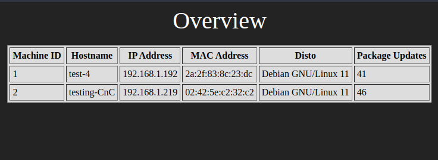

# CnC-WebGUI
WebGUI for giving overview to my CnC Bash Script

Docker containers made from scratch to collect data from the Linux server.



## Status

This is still an internal tools and has not been made available to the public yet.
It is also still under development and is not yet production ready.

### Basic Operation Procedures (BOP)

- Collect CPU, RAM and Disk usage.
- Collect data on docker version and other SOP (standard operation procedure) software version.
- Uptimer and warning.


### Advanced Operation Procedures (AOP)

- Change basic configs 
- Reboot/shutdown/update/upgrade
- Overview of cron jobs 
- Change and update cron jobs
- Tailscale VPN
- Docker images sync vulnerability scan 


## Development

#### Management interface 

This will be built based on a homemade docker stack, which includes Nginx for WebGUI and MySQL for database.

CnC WebGUI Managed will be made in HTML, Php, CSS and Javascript. CnC Monitor Agent will be made in bash, with either cron or systemctl as run-timer.

#### Remote Management 

It will also be possible to deploy with Tailscale VPN, so that a connection can be established between servers that are not on the same local network.

It may also be possible to use another program, but I have not tested other than Tailscale with automatic deployment.


#### Easy Deployment 

The idea behind this whole system is to have a better and faster overview of all my Linux servers, but without adding a maintenance problem with more new "Pre-made" software. 

So I make a bash script that sets up a Linux server to a CnC WebGUI Manager, as a Docker container and then I make another bash script to install the CnC Monitor Agent, which sends the data from the Linux servers to the CnC WebGUI Manager.

It will most likely be added 2 separate bash scripts containing Tailscale VPN for Remote Management.

KEEP IT SIMPLE STUPID.

## Software license 

The "software solution" will require an active license, which will be checked at startup.

So this software will not work without a license and/or internet.

However, the source code will be partially or fully available via github.

### Links and Sources

#### MySQL Docker:

```embed
title: "Build a custom MySQL Docker Container"
image: ""
description: "Tired of going through endless documentation for setting up your database in any computer apart from…"
url: "https://dev.to/sumana2001/build-a-custom-mysql-docker-container-404f"
```

#### Agent MySQL insert Data

```embed
title: "Using shell script to insert data into remote MYSQL database"
image: "https://cdn.sstatic.net/Sites/stackoverflow/Img/apple-touch-icon@2.png?v=73d79a89bded"
description: "I’ve been trying to get a shell(bash) script to insert a row into a REMOTE database, but I’ve been having some trouble :( The script is meant to upload a file to a server, get a URL, HASH, and a file"
url: "https://stackoverflow.com/questions/3900496/using-shell-script-to-insert-data-into-remote-mysql-database"
```

#### MySQL Install on Debian 10

```embed
title: "How To Install the Latest MySQL on Debian 10 | DigitalOcean"
image: ""
description: "MySQL is a prominent open source database management system used to store and retrieve data for a wide variety of popular applications. MySQL is the M in the…"
url: "https://www.digitalocean.com/community/tutorials/how-to-install-the-latest-mysql-on-debian-10"
```