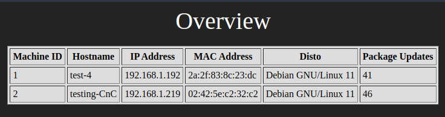
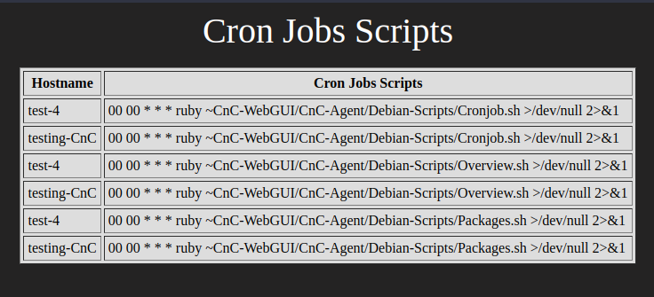
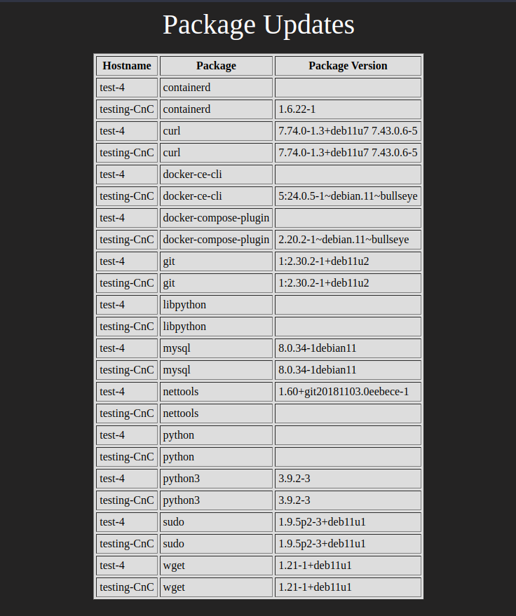

# CnC-WebGUI
**WebGUI for giving overview to my CnC Bash Script**

**Docker containers made from scratch to collect data from the Linux server.**

## Introduction

### Video Demo

[See how to deploy the code](https://media.rp-helpdesk.com/view?m=CLXrOulOT)

### Requriements 

>[!IMPORTANT]
>**Web/db Server**
>* Git install on the web/db server
>* Docker + Docker-compose installed on the web/db server

>[!IMPORTANT]
>**Agent Devices**
>* No packages requried now (May change in the future)

### Overview


**Get an easy overview over the server.** 

>[!IMPORTANT]
>* Hostname
>* IP Address
>* MAC Address
>* Disto
>* Updates ready

-----------------------------------------------------------

### Cron Jobs Scripts


**Get an easy overview over cron jobs.**
>[!WARNING]
> This is not yet fully supported
>
>* Only shows CnC Scripts for now

-----------------------------------------------------------

### Package Version


**Get an easy overview over a handfull of packages.**
>[!IMPORTANT]
> This has a planned expansion for more and user picked packages
>
>* git
>* wget
>* sudo
>* python
>* python3
>* nettools
>* mysql
>* libpython
>* docker-ce-cli
>* docker-compose-plugin
>* curl
>* containerd

-----------------------------------------------------------

## Status
>[!WARNING]
>This is still an internal tools and has not been made available to the public yet.
>It is also still under development and is not yet production ready.

### Basic Operation Procedures (BOP)
>[!NOTE]
>- Collect CPU, RAM and Disk usage.
>- Collect data on docker version and other SOP (standard operation procedure) software version.
>- Uptimer and warning.


### Advanced Operation Procedures (AOP)
>[!NOTE]
>- Change basic configs 
>- Reboot/shutdown/update/upgrade
>- Overview of cron jobs 
>- Change and update cron jobs
>- Tailscale VPN
>- Docker images sync vulnerability scan 

-----------------------------------------------------------

## Development

#### Management interface 
>[!NOTE]
>This will be built based on a homemade docker stack, which includes Nginx for WebGUI and MySQL for database.
>
>CnC WebGUI Managed will be made in HTML, Php, CSS and Javascript. CnC Monitor Agent will be made in bash, with either cron or systemctl as run-timer.

#### Remote Management 
>[!NOTE]
>It will also be possible to deploy with Tailscale VPN, so that a connection can be established between servers that are not on the same local network.
>
>It may also be possible to use another program, but I have not tested other than Tailscale with automatic deployment.


#### Easy Deployment 
>[!NOTE]
>The idea behind this whole system is to have a better and faster overview of all my Linux servers, but without adding a maintenance problem with more new "Pre-made" software. 
>
>So I make a bash script that sets up a Linux server to a CnC WebGUI Manager, as a Docker container and then I make another bash script to install the CnC Monitor Agent, which sends the data from the Linux servers to the CnC WebGUI Manager.
>
>It will most likely be added 2 separate bash scripts containing Tailscale VPN for Remote Management.
>
>KEEP IT SIMPLE STUPID.

## Installation


### Docker images
>[!NOTE]
>The images has not been made public yet, so if you want to use this right now.
>You will have to build the images yourself. 

>[!IMPORTANT]
>Steps:
>
>1. Git clone this repo. 
>2. Run CnC-Image-Builder.sh
>3. Input information web/db version + IP + Port for remote or local docker registry.
>
> This should make the two docker images and after they have been made it will use the docker-compose file to start the two dockers. When the two dockers are up and running, check the you don't have errors on the website.

>[!WARNING]
> (The WebGUI will give php errors at startup because it is still waiting for the database to come online)

>[!IMPORTANT]
>When it has come online you can then install the Agent to the servers you want to moniter.

#### Install Agent
>[!NOTE]
>Run the following commands on a Debian 10/11 server to install the agent.

>[!WARNING]
> The docker web and db containers has to be running.

```
cd /tmp 

wget https://raw.githubusercontent.com/rune004/CnC-WebGUI/Production/Download-Agent.sh 

bash Download-Agent.sh
```


#### Docker stack
>[!WARNING]
>Only make changes to the "mark" input.

```
version: "3.2"
services:
  cnc-webgui-db:                                                               <----- Do not change this
    image: cnc-mysql:1.0                                                       <----- Will be available at some point on dockerhub
    restart: always
    ports:
      - "3306:3306"                                                            <----- Do not change this
    environment:
      - MYSQL_ROOT_PASSWORD=12Marvel                                           <----- Do not change this
      - MYSQL_DATABASE=machines                                                <----- Do not change this
      - MYSQL_ROOT_HOST=%                                                      <----- Do not change this
    command: --default-authentication-plugin=mysql_native_password             <----- Do not change this
    volumes:
      - ~/CnC-WebGUI/src:/cnc-webgui/db                                        <----- Do not change this
  web:
    image: cnc-web:1.0                                                         <----- Will be available at some point on dockerhub
    environment:
      - MYSQL_ROOT_PASSWORD=12Marvel                                           <----- Do not change this
      - MYSQL_USER=root                                                        <----- Do not change this
      - MYSQL_PASSWORD=12Marvel                                                <----- Do not change this
      - MYSQL_DATABASE=machines                                                <----- Do not change this
      - MYSQL_HOST=db                                                          <----- Do not change this
    restart: always
    ports:
      - "8080:80"                                                              <----- Only change "8080" NOT "80" 
    depends_on:
      - cnc-webgui-db                                                          <----- Do not change this
    volumes:
      - ~/CnC-WebGUI/src:/cnc-webgui/web                                       <----- Do not change this
```